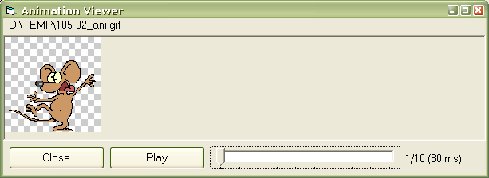



## VB Gif Library \(includes a native LZW decoder\)

### Description

VB Gif Library includes a set of classes for reading GIF images (both 87a and 89a variations) and rendering them through bitmaps or icons. The library features a native LZW decoder implemented in pure VB so there is no need anymore to rely on LoadPicture hacks for those animated GIFs. The decoder class is ~650 lines of code so it's really simple and easy to understand. The classes are designed with ease of integration with image processing applications in mind. Sample viewers are includes as to illustrate the usage of the renderer classes. Please, try test with various (animated) GIFs as much as possible and in case of problems comment here. Greetings go to Carles P. V. for his image processing submissions. Enjoy and leave your votes! Check out my other submissions too!
 
### More Info
 

             |
---                |---
**Submitted On**   |2003-03-23 23:40:18
**By**             |[Vlad Vissoultchev](https://github.com/Planet-Source-Code/PSCIndex/blob/master/ByAuthor/vlad-vissoultchev.md)
**Level**          |Intermediate
**User Rating**    |5.0 (124 globes from 25 users)
**Compatibility**  |VB 6\.0
**Category**       |[Graphics](https://github.com/Planet-Source-Code/PSCIndex/blob/master/ByCategory/graphics__1-46.md)
**World**          |[Visual Basic](https://github.com/Planet-Source-Code/PSCIndex/blob/master/ByWorld/visual-basic.md)
**Archive File**   |[VB\_Gif\_Lib1563783242003\.zip](https://github.com/Planet-Source-Code/vlad-vissoultchev-vb-gif-library-includes-a-native-lzw-decoder__1-44216/archive/master.zip)

